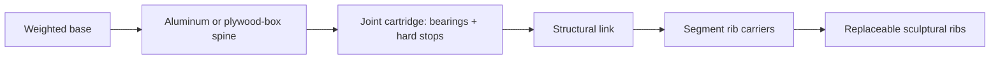

# Concept and Decisions

## The useful synthesis

The reference sculptures suggest three body-making grammars:

1. **Horizontal contour laminations** produce a topographic, geological body.
2. **Vertical contour laminations** reveal anatomy and work well around long limbs.
3. **Wire or mesh envelopes** preserve visual lightness and tolerate deformation.

Lamina should deliberately mix them: horizontal torso/head ribs, vertical limb ribs, and a soft mesh or cable-driven hand. A single slicing direction across every joint looks coherent while stationary but binds or collides once animated.

## Mechanical architecture

### Load path

Use a rigid central spine and conventional joint cartridges. The decorative ribs attach at sparse hard points and float elsewhere. Each moving body segment gets its own shell module; no slice crosses a joint axis.

Recommended construction:

- Base: steel plate or ballast box with four mounting holes.
- Spine: 20 × 40 mm aluminum extrusion for v0; a laminated plywood torsion box is the later all-wood expression.
- Links: aluminum tube or carbon tube with printed/ machined end fittings.
- Joint shells: removable rib cassettes with at least 25 mm swept-clearance around every pinch zone.
- Rib registration: four threaded rods or dowels with spacers; use slotted holes on one side to tolerate wood movement.
- Wiring: route through the neutral side of each joint, with strain relief and a service loop.
- Emergency stop: mount the primary latching mushroom button on a fixed upper-back crossmember between the shoulders. Orient it for a palm strike from behind, make it reachable from either side, and keep it outside arm sweep, removable shell panels, backpack hardware, and tether routing.
- Commissioning control: retain a wired hold-to-run pendant with its own stop control so the operator does not need to approach the moving robot during tests.

### Actuation

For the first demonstrator, integrated smart servos are preferable to hobby PWM servos because position, current/load, temperature, fault state, and bus telemetry are available. Select actuators only after measuring required torque on the link rig.

Use this sizing relation for a slow, quasi-static first pass:

`required continuous torque = safety factor × sum(mass × gravity × horizontal moment arm)`

Start with a safety factor of 2 for a guarded prototype, then verify thermal behavior experimentally. Counterbalance shoulder pitch using a gas spring, extension spring, or constant-force spring; reducing continuous torque is more valuable than simply buying a larger motor.

## Joint-to-sculpture rules

1. Every joint has a visible motion gap; celebrate it as a dark line.
2. No decorative rib is a primary bearing surface.
3. A shell module comes off without removing a motor or disturbing calibration.
4. Fingers begin as compliant cable mechanisms, not five tiny rigid robot arms.
5. Any opening that can admit a finger near motion receives a guard, bellows, or safe spacing.
6. The silhouette is generated from the robot's actual swept volumes, not from a static human mesh.

## Intelligence architecture decision

The larger local brain may contain a language model and perception models. A smaller model on the motor computer is optional, but it must not sit inside the stabilizing feedback loop. At most it can classify context, choose among pre-certified skills, or explain faults.

The separation is:

- **Language:** “look toward the person and offer a greeting.”
- **Task executive:** resolves this to `look_at` then `gesture`, checks prerequisites and priorities.
- **Skill controller:** generates bounded trajectories from known primitives.
- **Joint controller:** closes position/velocity/current loops and enforces hard limits.
- **Independent safety:** removes drive enable on E-stop, watchdog loss, overtravel, or unsafe power state.

## Product directions worth preserving

- **Sculpture-first companion:** expressive head, torso, and arms; no locomotion.
- **Telepresence figure:** remote person supplies intent while local control enforces safe movement.
- **Museum/performance platform:** scripted choreography, swappable bodies, rich lighting and sound.
- **Research manipulator:** fixed pedestal, one useful arm, sculptural shell around industrially honest mechanics.
- **Eventual mobile humanoid:** wheeled base before legs; legs only after the upper-body safety case is mature.

## Open design choices for the next review

- Human-realistic proportions versus intentionally abstract proportions
- Exposed dark skeleton versus concealed skeleton
- Plywood species, finish, and flame treatment for installation context
- One arm versus mirrored second arm in v1
- Smart servo ecosystem and bus protocol
- Camera placement: eyes, sternum, or both
