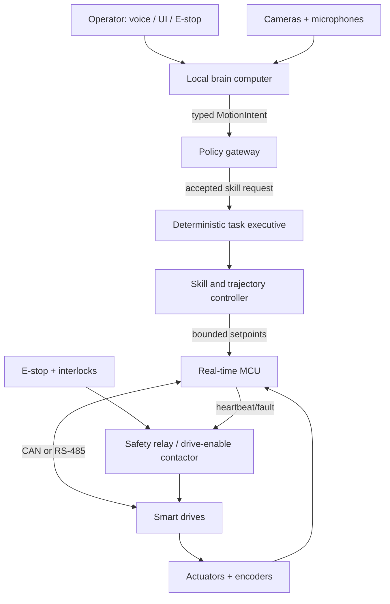
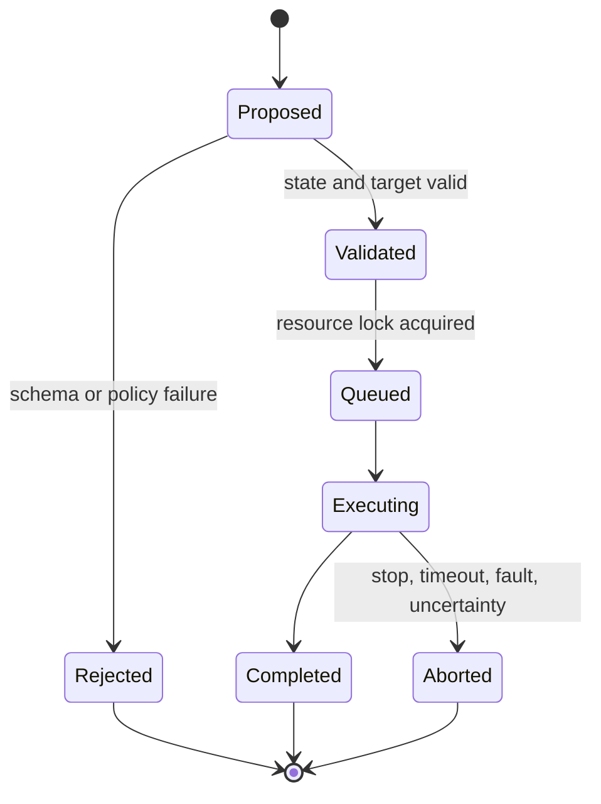

# Control Architecture

## Principle

Language proposes; deterministic software disposes. No probabilistic model is trusted with torque, PWM, drive enable, safety reset, limit configuration, or arbitrary code execution.

## Runtime layers

| Layer | Typical rate | Responsibility | May stop motion? |
|---|---:|---|---|
| Electrical safety chain | Continuous | E-stop, contactor, STO/drive enable, fuse, interlock | Yes, independently |
| Motor/joint firmware | 500–1,000 Hz | Encoder feedback, limits, current/temperature checks, watchdog | Yes |
| Skill controller | 100–250 Hz | Time-parameterized trajectories, collision and speed constraints | Yes |
| Task executive | 10–30 Hz | Skill sequencing, resource locks, state validation | Yes |
| Perception/world model | 5–30 Hz | People, obstacles, targets, uncertainty | Requests stop |
| Local language brain | Event driven | Interpret instructions, clarify, plan named skills | Requests only |

## Deployment topology

Keep the brain and motor domains separable. Rebooting the Linux computer must cause a controlled stop, not uncontrolled motion. Loss of the language process should leave the machine stationary and recoverable.

## Motion-intent contract

The schema in `interfaces/motion-intent.schema.json` is the only accepted LLM-to-executive interface in v0. It deliberately exposes named skills, not joint arrays.

Initial certified skills:

- `home`: move to a calibrated neutral pose.
- `hold`: stop trajectory progression and hold position with configured limits.
- `look_at`: orient head toward a validated target in a small workspace.
- `gesture`: play a reviewed gesture from a finite library.
- `point_at`: point only to a perceived, reachable target while the arm workspace is clear.
- `safe_stop`: decelerate and disable ordinary motion requests.

Every request has a short deadline, priority, expected robot mode, and explicit constraints. The policy gateway rejects unknown fields and unknown skills.

## Command lifecycle

## Minimum telemetry

Log with synchronized monotonic timestamps:

- Intent, policy decision, requester, and model/software versions
- Skill state transitions and reason codes
- Joint position, velocity, estimated effort/current, temperature, and limit status
- Safety-chain state, E-stop state, heartbeat, and bus errors
- Perception confidence for targets used by motion
- Operator interventions, resets, and maintenance mode entry

## Network and process boundaries

- Motor network is not routed to the internet.
- Brain-to-executive endpoint is authenticated locally and accepts schema-valid messages only.
- Firmware accepts setpoints solely from the skill controller and times them out.
- Safety reset requires a physical action plus software acknowledgement; a language model cannot reset a fault.
- The primary E-stop is a latching mushroom button on the fixed rear upper torso at shoulder height. It remains electrically independent of the brain computer and mechanically independent of removable wooden body panels.
- A commissioning pendant provides a second operator-held stop path during development and maintenance.
- Updates are signed/versioned, and the active configuration hash is recorded with every run.
