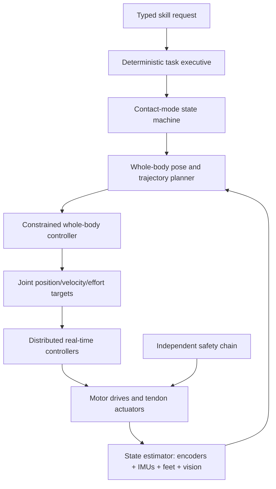

# Full-Body Control Architecture

## Recommended progression

Begin with quasi-static, contact-constrained motion. Dynamic walking is not the first controller milestone.

## Contact modes

- `DOUBLE_SUPPORT`
- `LEFT_SUPPORT`
- `RIGHT_SUPPORT`
- `KNEEL_SUPPORT`
- `STAIR_THREE_CONTACT`
- `LADDER_THREE_POINT_CONTACT`
- `SUPPORTED_RECOVERY`
- `PROTECTIVE_STOP`

Transition only when commanded contacts are confirmed by independent sensing and the estimated center of mass remains inside the permitted support region.

## Controller stages

1. Joint-by-joint bench control.
2. Suspended lower-body position control.
3. Double-support inverse kinematics.
4. Quasi-static center-of-mass transfer.
5. Tethered stepping with ideal contact sequence.
6. Disturbance rejection at low speed.
7. Stair state machine.
8. Ladder three-point-contact state machine.

## Core constraints

- Joint position, velocity, acceleration, effort, tendon force and temperature limits.
- Self-collision and cable-clearance limits.
- Foot and hand contact-force bounds.
- Center-of-pressure margin from support edges.
- Minimum three contacts during ladder transitions.
- No motion plan may depend on an LLM completing on time.
- State-estimation uncertainty above threshold causes a protective stop.

## Estimator inputs

- Output-side joint encoders at every axis.
- Pelvis and torso IMUs.
- Four or more force zones per foot.
- Tendon force or motor-current estimates.
- Hand/rung contact sensing.
- Depth cameras for slow environment registration; vision is not the independent safety channel.

