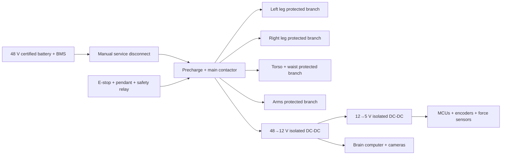

# Power and Network Architecture

## Power domains

## Communication segments

| Segment | Devices | Failure containment |
|---|---|---|
| Lower-left bus | Left hip, knee, ankle drives and MCU | Local protective stop plus whole-body stop request |
| Lower-right bus | Right hip, knee, ankle drives and MCU | Local protective stop plus whole-body stop request |
| Upper-body bus | Waist, shoulders, elbows and wrists | Arms stop without corrupting leg bus |
| Sensor bus | Feet, hands, IMUs and safety feedback | Invalidates contact mode on timeout |
| Brain Ethernet | Perception, planning, logging | Loss causes controlled stop; cannot block safety chain |

Use isolated CAN-FD or an equivalently deterministic differential bus for real-time segments. Final protocol depends on actuator selection.

## Peak management

- Prevent all H-class axes from accelerating simultaneously.
- Sequence stand-up, stair and ladder motions to limit branch peaks.
- Monitor branch current and battery voltage at ≥1 kHz for protection and ≥100 Hz for logs.
- Reserve energy and power margin for controlled descent and safe kneeling.
- Battery undervoltage blocks new climbing transitions and initiates a supported stop.

## Required hardware protection

- Main fuse sized to cable and battery fault capability.
- Selective branch fuses/breakers.
- Precharge verification before contactor closure.
- Welded-contactor detection.
- Reverse-polarity and transient protection.
- Temperature monitoring at battery, contactor, DC-DC converters and high-current connectors.
- Fire-resistant battery enclosure separated from plywood with thermal barriers.

