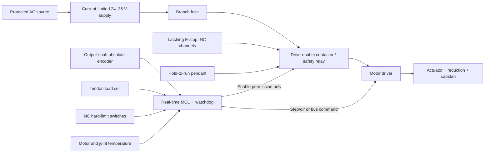

# Wiring and Safety Chain

## Wiring rules

- E-stop and deadman circuits operate independently of USB, Linux, networking, and language software.
- The MCU may withdraw enable but cannot override an open E-stop or deadman circuit.
- Use normally closed limit wiring so a broken wire faults safe.
- Separate motor power from encoder/load-cell wiring; cross at right angles where unavoidable.
- Bond exposed purchased metal hardware appropriately and document the DC return strategy.
- Add strain relief at every moving or removable connection.
- Record wire gauge, fuse rating, connector, pinout, and cable length after actuator selection.

## Connector draft

| Connector | Signals |
|---|---|
| J1 Power | DC+, DC−, protective/chassis bond as applicable |
| J2 Motor | Driver-specific motor phases and brake if present |
| J3 Encoder | 5 V/3.3 V, ground, SPI or ABI signals |
| J4 Load cell | Excitation+, excitation−, signal+, signal− |
| J5 Limits | NC minimum, NC maximum, common |
| J6 Safety | E-stop channel A/B, deadman channel, drive-enable feedback |

